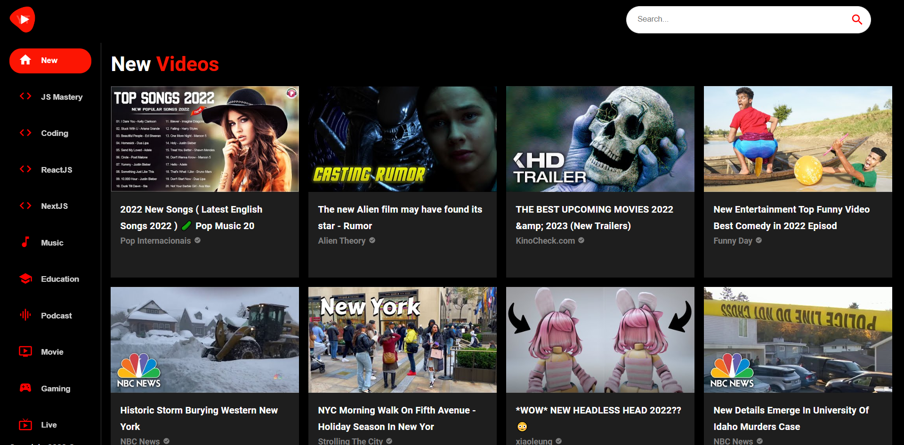
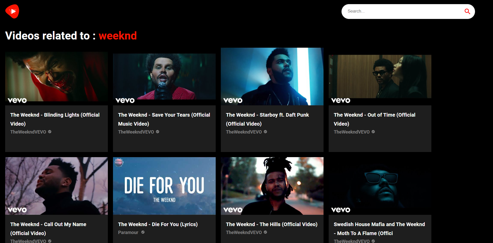

If you wish to test this project out on your local machine, you may download the zip file and subscribe to Youtube V3 API on RapidAPI and use your key in .env file.

I would suggest referring Material UI documentation for more information about the styles and props used in this project.
https://mui.com/material-ui/

I would also highly recommend you understand Youtube V3's API documentation.
https://developers.google.com/youtube/v3/docs
Here are some screenshots of the project:

 Home Screen 

 Playback Screen 

 Search Result Screen 

 Responsive Screen 

PS : The project isn't entirely bug-free, but it was a great lesson to learn about API interactions and component based development using React Js.
